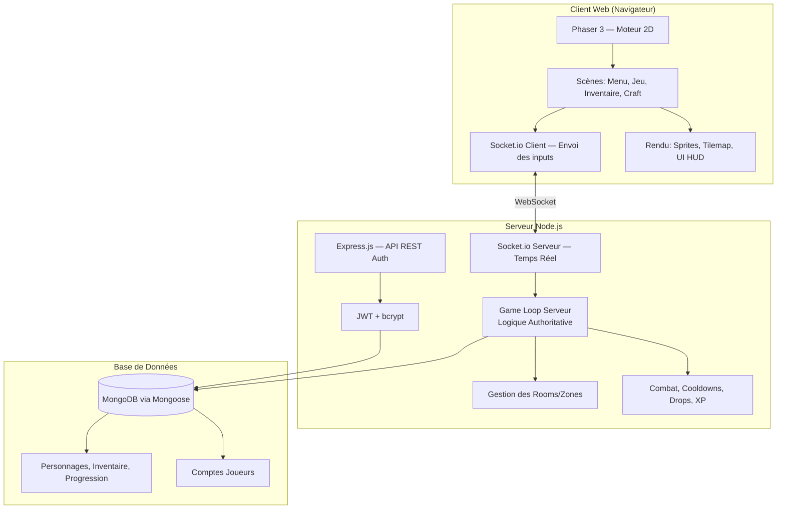

# 🎮 Action-RPG 2D Coopératif en Ligne — Architecture Technique & Plan d'Action

## 1. Architecture Technique Globale



### Front-End (Client)

| Technologie | Rôle |
|---|---|
| **Phaser 3** | Moteur de jeu 2D (rendu Canvas/WebGL, physique, tilemaps, sprites, animations) |
| **Socket.io-client** | Communication temps réel avec le serveur (envoi des inputs, réception de l'état) |
| **Vite** | Bundler ultra-rapide pour le développement et le build |

> [!IMPORTANT]
> Le client est **"dumb"** : il envoie uniquement les inputs (direction, sort lancé) et **affiche l'état reçu du serveur**. Aucun calcul de gameplay côté client (Server-Authoritative).

### Back-End (Serveur)

| Technologie | Rôle |
|---|---|
| **Node.js** | Runtime serveur |
| **Express.js** | API REST pour l'authentification (register, login) |
| **Socket.io** | Communication bidirectionnelle temps réel (game state sync) |
| **JWT (jsonwebtoken)** | Tokens d'authentification stateless |
| **bcrypt** | Hashage sécurisé des mots de passe |

### Base de Données

| Technologie | Rôle |
|---|---|
| **MongoDB** | Stockage des comptes, personnages, inventaires, progression |
| **Mongoose** | ODM pour structurer les schémas et valider les données |

### Outils & DevOps

| Outil | Rôle |
|---|---|
| **nodemon** | Rechargement automatique du serveur en dev |
| **concurrently** | Lancer client + serveur en une commande |
| **dotenv** | Variables d'environnement (.env) |

---

## 2. Structure des Dossiers du Projet

```
2D-RPG/
├── client/                          # Application front-end (Phaser + Vite)
│   ├── public/
│   │   └── assets/                  # Sprites, tilemaps, sons, images IA
│   │       ├── sprites/
│   │       │   ├── characters/      # Sprites joueurs (assassin, mage, etc.)
│   │       │   ├── monsters/        # Sprites monstres
│   │       │   └── effects/         # Effets visuels (sorts, impacts)
│   │       ├── tilemaps/            # Fichiers .json des maps (Tiled)
│   │       ├── tilesets/            # Images des tilesets
│   │       └── ui/                  # Éléments d'interface (icônes, boutons)
│   ├── src/
│   │   ├── main.js                  # Point d'entrée Phaser
│   │   ├── config.js                # Configuration Phaser (résolution, physique)
│   │   ├── scenes/                  # Scènes Phaser
│   │   │   ├── BootScene.js         # Chargement des assets
│   │   │   ├── LoginScene.js        # Écran de connexion/inscription
│   │   │   ├── CharacterSelectScene.js
│   │   │   ├── GameScene.js         # Scène principale de jeu
│   │   │   ├── UIScene.js           # HUD (vie, mana, XP, sorts)
│   │   │   ├── InventoryScene.js    # Inventaire & équipement
│   │   │   └── CraftScene.js        # Interface d'artisanat
│   │   ├── entities/                # Représentations visuelles
│   │   │   ├── PlayerSprite.js      # Sprite joueur (interpolation)
│   │   │   ├── MonsterSprite.js     # Sprite monstre
│   │   │   └── LootSprite.js        # Objets au sol
│   │   ├── network/                 # Communication réseau
│   │   │   └── SocketManager.js     # Connexion Socket.io, envoi/réception
│   │   ├── ui/                      # Composants UI du HUD
│   │   │   ├── HealthBar.js
│   │   │   ├── SpellBar.js          # 4 sorts + bindings clavier
│   │   │   └── ChatBox.js
│   │   └── utils/
│   │       └── InputHandler.js      # Capture ZQSD + touches sorts
│   ├── index.html
│   ├── vite.config.js
│   └── package.json
│
├── server/                          # Application back-end (Node.js)
│   ├── src/
│   │   ├── index.js                 # Point d'entrée serveur
│   │   ├── config/
│   │   │   └── db.js                # Connexion MongoDB
│   │   ├── auth/                    # Authentification
│   │   │   ├── authRoutes.js        # Routes /register, /login
│   │   │   ├── authController.js    # Logique register/login
│   │   │   └── authMiddleware.js    # Vérification JWT
│   │   ├── game/                    # Logique de jeu (Server-Authoritative)
│   │   │   ├── GameLoop.js          # Boucle de jeu côté serveur (tick)
│   │   │   ├── RoomManager.js       # Gestion des rooms/zones
│   │   │   ├── PlayerState.js       # État joueur (position, HP, cooldowns)
│   │   │   ├── MonsterManager.js    # Spawn, IA, loot table
│   │   │   ├── CombatSystem.js      # Calcul dégâts, sorts, cooldowns
│   │   │   ├── LootSystem.js        # Calcul drops, rareté
│   │   │   └── CraftSystem.js       # Recettes, validation craft
│   │   ├── models/                  # Schémas Mongoose
│   │   │   ├── User.js              # Compte joueur (email, hash)
│   │   │   ├── Character.js         # Personnage (classe, stats, niveau)
│   │   │   └── Inventory.js         # Inventaire (items, équipement)
│   │   ├── data/                    # Données statiques du jeu
│   │   │   ├── classes.json         # Stats de base par classe
│   │   │   ├── spells.json          # Sorts par classe
│   │   │   ├── monsters.json        # Types de monstres, stats, loots
│   │   │   ├── items.json           # Catalogue d'items/équipements
│   │   │   └── recipes.json         # Recettes de craft
│   │   └── network/
│   │       └── SocketHandler.js     # Gestion événements Socket.io
│   ├── .env                         # Variables d'environnement
│   └── package.json
│
├── shared/                          # Code partagé client/serveur
│   ├── constants.js                 # Vitesse de déplacement, tick rate, etc.
│   └── helpers.js                   # Fonctions utilitaires partagées
│
└── README.md
```

---

## 3. Plan d'Action — 14 Étapes

### 🔹 Phase 1 : Fondations (Étapes 1-3)

#### Étape 1 — Setup Projet & Authentification
- Initialiser le monorepo (client Vite + serveur Node.js)
- Configurer Express, MongoDB/Mongoose, dotenv
- Implémenter Register/Login avec bcrypt + JWT
- Créer `LoginScene.js` côté Phaser (formulaire login/register)
- **Livrable :** Un joueur peut créer un compte et se connecter

#### Étape 2 — Moteur 2D de base (Client)
- Configurer Phaser 3 avec Vite
- Créer `BootScene` (chargement assets) et `GameScene` (affichage map)
- Charger une tilemap de test (créée avec Tiled Map Editor)
- Afficher un sprite joueur, mouvement local ZQSD
- **Livrable :** Un joueur se déplace sur une map dans le navigateur

#### Étape 3 — Synchronisation Multijoueur (Déplacements)
- Connecter Socket.io côté client et serveur
- Le serveur reçoit les inputs → calcule la position → renvoie l'état
- Le client affiche les positions reçues (interpolation)
- Plusieurs navigateurs voient les joueurs se déplacer ensemble
- **Livrable :** 2+ joueurs se voient et se déplacent en temps réel

---

### 🔹 Phase 2 : Personnage & Combat (Étapes 4-6)

#### Étape 4 — Création de Personnage & Classes
- Interface de création (choix sexe, nom, classe)
- Schéma MongoDB `Character` avec stats de base par classe
- Fichier `classes.json` (Assassin, Mage, Paladin, Ranger, Nécromancien)
- Afficher le bon sprite selon la classe choisie
- **Livrable :** Choix de classe fonctionnel avec stats différenciées

#### Étape 5 — Système de Combat (Server-Authoritative)
- Implémenter `CombatSystem.js` côté serveur
- 4 sorts par classe (`spells.json`) avec cooldowns validés serveur
- `SpellBar.js` côté client : affichage des 4 sorts, binding clavier personnalisable
- Animations d'attaque et effets visuels (Phaser)
- **Livrable :** Un joueur peut lancer des sorts avec cooldowns

#### Étape 6 — Monstres & IA
- `MonsterManager.js` : spawn de monstres par zone
- IA basique (patrouille, aggro, poursuite, attaque)
- Monstres ont HP, dégâts, zone d'aggro
- Mort du monstre → gain XP (validé serveur)
- **Livrable :** Des monstres apparaissent, attaquent, et peuvent être tués

---

### 🔹 Phase 3 : Progression & Économie (Étapes 7-9)

#### Étape 7 — Système de Niveaux & XP
- Calcul XP → Level (1 à 100), courbe exponentielle
- Gain de stats automatique par niveau selon la classe
- Affichage barre XP dans le HUD (`UIScene.js`)
- **Livrable :** Le personnage monte en niveau en tuant des monstres

#### Étape 8 — Loot & Inventaire
- `LootSystem.js` : tables de drop par monstre, rareté (Common → Legendary)
- Schéma `Inventory` MongoDB
- `InventoryScene.js` : grille d'inventaire, slots d'équipement
- Équiper un objet modifie les stats (validé serveur)
- **Livrable :** Les monstres droppent des objets, le joueur peut s'équiper

#### Étape 9 — Récolte & Artisanat
- Nœuds de récolte sur la map (bois, minerai, herbes)
- `CraftSystem.js` : recettes dans `recipes.json`
- `CraftScene.js` : interface de craft
- **Livrable :** Récolte de ressources et fabrication d'objets fonctionnelles

---

### 🔹 Phase 4 : Monde & Level Design (Étapes 10-12)

#### Étape 10 — Zones & Biomes Multiples
- Créer 3-4 biomes (Forêt, Désert, Marais, Donjon) avec Tiled
- `RoomManager.js` : transition entre zones via portails
- Monstres adaptés à chaque biome (niveaux croissants)
- **Livrable :** Plusieurs zones explorables avec difficulté progressive

#### Étape 11 — Boss Fights
- Boss unique par zone avec mécaniques spéciales
- Patterns d'attaque scriptés (phases, attaques spéciales)
- Récompenses de boss rares
- **Livrable :** Combats de boss épiques en coopération

#### Étape 12 — Chat & Interactions Sociales
- Chat textuel en jeu (`ChatBox.js`)
- Invitations de groupe / party system
- Affichage des noms et niveaux au-dessus des joueurs
- **Livrable :** Communication et coopération entre joueurs

---

### 🔹 Phase 5 : Polish & Production (Étapes 13-14)

#### Étape 13 — UI/UX & HUD Avancé
- Écran de personnage détaillé (stats, équipement visuel)
- Mini-map
- Notifications (level up, loot rare, achievement)
- Sons et musique d'ambiance
- **Livrable :** Expérience utilisateur polie et immersive

#### Étape 14 — Optimisation, Sécurité & Déploiement
- Rate limiting, validation stricte de tous les inputs
- Anti-cheat renforcé (vérifications serveur)
- Optimisation réseau (delta compression, interpolation avancée)
- Déploiement (serveur VPS, MongoDB Atlas, CDN pour les assets)
- Tests de charge multi-joueurs
- **Livrable :** Jeu déployé, sécurisé et prêt pour la beta

---

## Résumé des Technologies

| Couche | Technologie |
|---|---|
| **Moteur de jeu** | Phaser 3 (WebGL/Canvas) |
| **Bundler client** | Vite |
| **Serveur** | Node.js + Express |
| **Temps réel** | Socket.io |
| **Auth** | JWT + bcrypt |
| **BDD** | MongoDB + Mongoose |
| **Maps** | Tiled Map Editor (export JSON) |
| **Assets** | Générés par IA + Spritesheets |

---

## Verification Plan

### Pour l'Étape 1 (première à implémenter) :
1. **Test Auth API** : Utiliser le navigateur ou curl pour tester `POST /api/auth/register` et `POST /api/auth/login`
2. **Test JWT** : Vérifier qu'un token est retourné et qu'il protège les routes
3. **Test UI Login** : Ouvrir le client dans le navigateur, créer un compte, se connecter
4. **Test BDD** : Vérifier dans MongoDB que l'utilisateur est créé avec un mot de passe hashé (jamais en clair)
